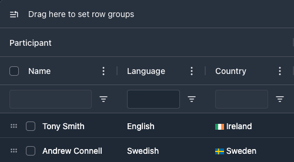
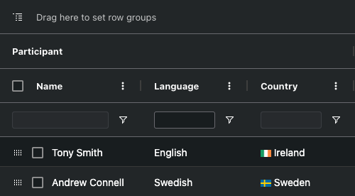

<!-- Additional Badges for consideration -->
<!--  -->

<div align="center">
    <picture>
      <source media="(prefers-color-scheme: dark)" srcset="https://github.com/ag-grid/ag-grid/blob/latest/documentation/ag-grid-docs/public/images/ag-logos/svg-logos/AG-Grid-Logo_Dark-Theme.svg?raw=true"/>
      <source media="(prefers-color-scheme: light)" srcset="https://github.com/ag-grid/ag-grid/blob/latest/documentation/ag-grid-docs/public/images/ag-logos/svg-logos/AG-Grid-Logo_Light-Theme.svg?raw=true"/>
      
    </picture>
    <div align="center">
        <h4><a href="https://www.ag-grid.com">🌐 Website</a> • <a href="https://www.ag-grid.com/javascript-data-grid/getting-started/">📖 Documentation</a> • <a href="https://www.ag-grid.com/community">🏘️ Community</a></h4>
    </div>
    <br>
    <a href="https://github.com/ag-grid/ag-grid/releases">
        
    </a>
    <a href="https://www.npmjs.com/package/ag-grid-community">
        
    </a>
    <a href="https://github.com/ag-grid/ag-grid">
        
    </a>
    <a href="https://github.com/ag-grid/ag-grid">
        
    </a>
    <br><br>
    <a href="https://sonarcloud.io/dashboard?id=ag-grid-enterprise">
      
    </a>
    <a href="https://npm.io/package/ag-grid-community">
        
    </a>
    <a href="https://github.com/ag-grid/ag-grid/graphs/commit-activity">
        
    </a>
    <a href="https://github.com/ag-grid/ag-grid/network/dependents">
        
    </a>
    <br><br>
    <p>AG Grid is a <strong>fully-featured</strong> and <strong>highly customizable</strong> JavaScript Data Grid. It delivers <strong>outstanding performance</strong>, has <strong>no third-party dependencies</strong> and comes with support for <strong><a href="https://github.com/ag-grid/ag-grid/tree/latest/packages/ag-grid-react"> React</a></strong>, <strong><a href="https://github.com/ag-grid/ag-grid/tree/latest/packages/ag-grid-angular"> Angular</a></strong> and <strong><a href="https://github.com/ag-grid/ag-grid/tree/latest/packages/ag-grid-vue"> Vue</a></strong>.</p>
    <br>
</div>


<br><br>

## 📖 Overview

<details>
  <summary><strong>Table of Contents</strong></summary>

- [📖 Overview](#-overview)
  - [Features](#features)
  - [Examples](#examples)
- [⚡️ Quick Start](#️-quick-start)
  - [Installation](#installation)
  - [Setup](#setup)
  - [Seed Projects](#seed-projects)
- [🛠️ Customisations](#️-customisations)
  - [Custom Components](#custom-components)
  - [Themes](#themes)
  - [Custom Themes](#custom-themes)
- [🌍 Community](#-community)
  - [Tools \& Extensions](#tools--extensions)
    - [Adaptable](#adaptable)
    - [Astro UXDS](#astro-uxds)
  - [Showcase](#showcase)
  - [Stargazers](#stargazers)
- [🤝 Support](#-support)
  - [Issue Reporting](#issue-reporting)
  - [Asking Questions](#asking-questions)
  - [Contributing](#contributing)
  - [License](#license)

</details>

AG Grid is available in two versions: Community & Enterprise. 

- `ag-grid-community` is free, available under the MIT license, and comes with all of the core features expected from a JavaScript Data Grid, including Sorting, Filtering, Pagination, Editing, Custom Components, Theming and more.
- `ag-grid-enterprise` is available under a commercial license and comes with advanced features, like Integrated Charting, Row Grouping, Aggregation, Pivoting, Master/Detail, Server-side Row Model, and Exporting in addition to dedicated support from our Engineering team.

### Features

| Feature                      | AG Grid Community | AG Grid Enterprise |
| ---------------------------- | ----------------- | ------------------ |
| Sorting                      | ✅                | ✅                 |
| Filtering                    | ✅                | ✅                 |
| Pagination                   | ✅                | ✅                 |
| Cell Editing                 | ✅                | ✅                 |
| Themes and Styling           | ✅                | ✅                 |
| Selection                    | ✅                | ✅                 |
| Accessibility                | ✅                | ✅                 |
| Custom Components            | ✅                | ✅                 |
| Infinite Scrolling           | ✅                | ✅                 |
| CSV Export                   | ✅                | ✅                 |
| Drag & Drop                  | ✅                | ✅                 |
| Integrated Charting          | ❌                | ✅                 |
| Row Grouping and Aggregation | ❌                | ✅                 |
| Pivoting                     | ❌                | ✅                 |
| Range Selection              | ❌                | ✅                 |
| Advanced Filtering           | ❌                | ✅                 |
| Server-Side Row Model        | ❌                | ✅                 |
| Excel Export                 | ❌                | ✅                 |
| Master/Detail                | ❌                | ✅                 |
| Tree Data                    | ❌                | ✅                 |
| Column menu                  | ❌                | ✅                 |
| Context menu                 | ❌                | ✅                 |
| Clipboard                    | ❌                | ✅                 |

> [!IMPORTANT]
> Visit the [License](https://www.ag-grid.com/license-pricing/) page for a full comparison.

### Examples

<details open>
  <summary>🏦 <b>Financial Demo</b></summary>
  <br>
  <p>Financial data example featuring live updates and sparklines:</p>
  <a href="https://ag-grid.com/example-finance/">
    
  </a>
  <br>
  <div align="right"><span><a href="https://ag-grid.com/example-finance/">View Demo 💻</a></span>&nbsp;&nbsp;<span><a href="https://github.com/ag-grid/ag-grid-demos/tree/main/finance">Source Code 🧑‍💻</a></span></div>
<br>
</details>
<details>
  <summary>📦 <b>Inventory Demo</b></summary>
  <br>
  <p>Inventory data example to view and manage products:</p>
  <a href="https://ag-grid.com/example-inventory/">
    
  </a>
  <div align="right"><span><a href="https://ag-grid.com/example-inventory/">View Demo 💻</a></span>&nbsp;&nbsp;<span><a href="https://github.com/ag-grid/ag-grid-demos/tree/main/inventory">Source Code 🧑‍💻</a></span></div>
<br>
</details>
<details>
    
  <summary>🧑‍💼 <b>HR Demo</b></summary>
  <br>
  <p>HR data example showing hierarchical employee data:</p>
  <a href="https://ag-grid.com/example-hr/">
    
  </a>
  <div align="right"><span><a href="https://ag-grid.com/example-hr/">View Demo 💻</a></span>&nbsp;&nbsp;<span><a href="https://github.com/ag-grid/ag-grid-demos/tree/main/hr">Source Code 🧑‍💻</a></span></div>
<br>
</details>

## ⚡️ Quick Start

AG Grid is easy to set up - all you need to do is provide your data and define your column structure. Read on for vanilla JavaScript installation instructions, or refer to our framework-specific guides for <strong><a href="https://github.com/ag-grid/ag-grid/tree/latest/packages/ag-grid-react"> React</a></strong>, <strong><a href="https://github.com/ag-grid/ag-grid/tree/latest/packages/ag-grid-angular"> Angular</a></strong> and <strong><a href="https://github.com/ag-grid/ag-grid/tree/latest/packages/ag-grid-vue"> Vue</a></strong>.

### Installation

```sh
$ npm install --save ag-grid-community
```

### Setup

1. Add a placeholder to HTML

```html
<div id="myGrid" style="height: 150px; width: 600px" class="ag-theme-quartz"></div>
```

2. Import the grid and styles

```js
import { createGrid } from 'ag-grid-community';
import 'ag-grid-community/styles/ag-grid.css';
import 'ag-grid-community/styles/ag-theme-quartz.css';
```

3. Set configuration

```js
// Grid Options: Contains all of the Data Grid configurations
const gridOptions = {
    // Row Data: The data to be displayed.
    rowData: [
        { make: 'Tesla', model: 'Model Y', price: 64950, electric: true },
        { make: 'Ford', model: 'F-Series', price: 33850, electric: false },
        { make: 'Toyota', model: 'Corolla', price: 29600, electric: false },
    ],
    // Column Definitions: Defines the columns to be displayed.
    columnDefs: [{ field: 'make' }, { field: 'model' }, { field: 'price' }, { field: 'electric' }],
};
```

4. Initialise the grid

```js
const eGridDiv = document.querySelector('#myGrid');
const api = createGrid(eGridDiv, gridOptions);
```

> [!IMPORTANT]
> For more information on building Data Grids with AG Grid, refer to our [Documentation](https://www.ag-grid.com/javascript-data-grid/getting-started/?utm_source=ag-grid-readme&utm_medium=repository&utm_campaign=github).

### Seed Projects 

We also provide [Seed Projects](https://github.com/ag-grid/ag-grid-seed) to help you get started with common configurations:

<details>
  <summary>&nbsp;TypeScript</summary>

- [Vite](https://github.com/ag-grid/ag-grid-seed/tree/main/enterprise/packages/vite-typescript)
- [Webpack5](https://github.com/ag-grid/ag-grid-seed/tree/main/enterprise/packages/webpack5-typescript)
</details>

<details>
  <summary>&nbsp;JavaScript</summary>

- [Webpack5](https://github.com/ag-grid/ag-grid-seed/tree/main/enterprise/packages/webpack5-javascript)
</details>

<details>
  <summary>&nbsp;React</summary>

- [Create React App](https://github.com/ag-grid/ag-grid-seed/tree/main/enterprise/packages/create-react-app): A minimal starter setup for AG Grid built using [Create React App (CRA)](https://github.com/facebook/create-react-app).
- [Vite](https://github.com/ag-grid/ag-grid-seed/tree/main/enterprise/packages/vite-react): This template provides a minimal setup to get AG Grid React working in Vite with HMR and some ESLint rules.

</details>

<details>
  <summary>&nbsp;Angular</summary>

- [Angular CLI](https://github.com/ag-grid/ag-grid-seed/tree/main/enterprise/packages/angular-cli): 
</details>

<details>
  <summary>&nbsp;Vue</summary>

- [Nuxt](https://github.com/ag-grid/ag-grid-seed/tree/main/enterprise/packages/nuxt-vue3): Contains a minimal starter setup using Nuxt 3, a free and open-source framework with an intuitive and extendable way to create type-safe, performant and production-grade full-stack web applications and websites with Vue.js.
- [Vite](https://github.com/ag-grid/ag-grid-seed/tree/main/enterprise/packages/vite-vue3): This template should help get you started developing with Vue 3 in Vite. The template uses Vue 3 `<script setup>`, a compile-time syntactic sugar for using Composition API inside Single-File Components (SFCs).
</details>

## 🛠️ Customisations

AG Grid is fully customisable, both in terms of appearance and functionality. There are many ways in which the grid can be customised and a selection of tools to help create those customisations.

### Custom Components

You can create your own Custom Components to customise the behaviour of the grid. For example, you can customise how cells are rendered, how values are edited and also create your own filters.

There are a number of different [Component Types](https://www.ag-grid.com/javascript-data-grid/components/) that you can provide to the grid, including:

* [Cell Component](https://www.ag-grid.com/javascript-data-grid/component-cell-renderer/): To customise the contents of a cell.
* [Header Component](https://www.ag-grid.com/javascript-data-grid/column-headers/): To customise the header of a column and column groups.
* [Edit Component](https://www.ag-grid.com/javascript-data-grid/cell-editors/): To customise the editing of a cell.
* [Filter Component](https://www.ag-grid.com/javascript-data-grid/component-filter/): For custom column filter that appears inside the column menu.
* [Floating Filter](https://www.ag-grid.com/javascript-data-grid/component-floating-filter/): For custom column floating filter that appears inside the column menu.
* [Date Component](https://www.ag-grid.com/javascript-data-grid/filter-date/#custom-selection-component): To customise the date selection component in the date filter.
* [Loading Component](https://www.ag-grid.com/javascript-data-grid/component-loading-cell-renderer/): To customise the loading cell row when using Server Side Row Model.
* [Overlay Component](https://www.ag-grid.com/javascript-data-grid/overlays/): To customise loading and no rows overlay components.
* [Status Bar Component](https://www.ag-grid.com/javascript-data-grid/status-bar/): For custom status bar components.
* [Tool Panel Component](https://www.ag-grid.com/javascript-data-grid/component-tool-panel/): For custom tool panel components.
* [Tooltip Component](https://www.ag-grid.com/javascript-data-grid/tooltips/): For custom cell tooltip components.
* [Menu Item Component](https://www.ag-grid.com/javascript-data-grid/component-menu-item/): To customise the menu items shown in the Column and Context Menus.

To supply a custom cell renderer and filter components to the Grid, create a direct reference to your component within the `gridOptions.columnDefs` property:

```js
gridOptions = {
   columnDefs: [
       {
           field: 'country', // The column to add the component to
           cellRenderer: CountryCellRenderer, // Your custom cell component
           filter: CountryFilter // Your custom filter component
       },
   ],
}
```

### Themes

AG Grid has 4 themes, each available in `light` & `dark` modes. We also supply each theme with an `auto` mode that can toggle the theme based on the users' system preferences:

<table>
    <tr><th>Quartz</th><th>Material</th></tr>
    <tr><td><a href="https://www.ag-grid.com/example/"></a></td><td><a href="https://www.ag-grid.com/example/?theme=material"></a></td></tr>
    <tr><th>Alpine</th><th>Balham</th</tr>
    <tr><td><a href="https://www.ag-grid.com/example/?theme=alpine"></a></td><td><a href="https://www.ag-grid.com/example/?theme=balham"></a></td></tr>
</table>

### Custom Themes

All AG Grid themes can be customised using [CSS variables](https://www.ag-grid.com/javascript-data-grid/global-style-customisation/), or you can create a new theme from scratch with the help of our [Theme Builder](https://www.ag-grid.com/theme-builder/) or [Figma Design System](./figma-design-system).

## 🌍 Community

### Tools & Extensions

AG Grid has a large and active community who have created an ecosystem of 3rd party tools, extensions and utilities to help you build your next project with AG Grid, no matter which language or framework you use. Browse the examples below, or visit our [Community](https://www.ag-grid.com/community/) section to learn more.

<details>
  <summary>&nbsp;React</summary>

#### Adaptable
AdapTable for AG Grid is a powerful extension for the market-leading AG Grid Data Grid. AdapTable extends the powerful functionality provided by AG Grid to enable you to build data management applications unparalleled in power and sophistication, with features not previously available.

#### Astro UXDS
Astro UXDS is a collection of guidelines, patterns and components for designing space-based user interface applications which provides a custom `Astro` theme for AG Grid.

- [name](link)
</details>

<details>
  <summary>&nbsp;Angular</summary>

- [name](link)
</details>

<details>
  <summary>&nbsp;TypeScript</summary>

- [name](link)
</details>

<details>
  <summary>&nbsp;Python</summary>

- [Dash AG Grid](https://www.figma.com/community/file/1360600846643230092/ag-grid-design-system](https://dash.plotly.com/dash-ag-grid)
</details>

<details>
  <summary>&nbsp;Svelte</summary>

- [AG Grid Svelte](https://ag-grid-svelte.michael.kim/guide/overview/)
</details>

<details>
  <summary>&nbsp;SolidJS</summary>

- [name](link)
</details>

<details>
  <summary>&nbsp;Vue</summary>

- [name](link)
</details>

<details>
  <summary>&nbsp;.NET</summary>

- [name](link)
</details>

<details>
  <summary>&nbsp;Rust</summary>

- [name](link)
</details>

<details>
  <summary>&nbsp;Laravel</summary>

- [name](link)
</details>

[View All](/)

### Showcase

AG Grid is used by 100,000's of developers across the world, from almost every industry. Whilst a lot of these projects are private, we've curated a selection of open-source projects from a variety of industries where household names rely on AG Grid, including [J.P.Morgan](https://www.saltdesignsystem.com/salt/components/ag-grid-theme/examples), [MongoDB](https://www.mongodb.com/products/tools/compass) and [Nasa](https://nasa-ammos.github.io/aerie-docs/).

<details>
  <summary>🏦&nbsp;Finance</summary>

- [OpenBB Terminal Pro](https://docs.openbb.co/pro/widgets/tabular-data)
</details>

<details>
  <summary>🤖&nbsp;ML/AI</summary>

- [MLFlow](https://mlflow.org/)
</details>

<details>
  <summary>🫙&nbsp;Database</summary>

- [MongoDB Compass](https://www.mongodb.com/products/tools/compass)
</details>

<details>
  <summary>🚀&nbsp;Aeronautics</summary>

- [NASA](https://nasa-ammos.github.io/aerie-docs/)
</details>

[View All](/)

### Stargazers

Founded in 2016, AG Grid has seen a steady rise in popularity and is now the market leader for Data Grids:

<picture>
  <source media="(prefers-color-scheme: dark)" srcset="https://api.star-history.com/svg?repos=ag-grid/ag-grid&type=Date&theme=dark"/>
  <source media="(prefers-color-scheme: light)" srcset="https://api.star-history.com/svg?repos=ag-grid/ag-grid&type=Date"/>
  
</picture>

## 🤝 Support

AG Grid Enterprise customers have access to dedicated support via [ZenDesk](https://ag-grid.zendesk.com/hc/en-us), which is monitored by our engineering teams.

### Issue Reporting

If you have found a bug, please report it in this repository's [issues](https://github.com/ag-grid/ag-grid/issues) section. If you're using the Enterprise version, please use the [private ticketing](https://ag-grid.zendesk.com/) system to do that.


### Asking Questions

Look for similar problems on [StackOverflow](https://stackoverflow.com/questions/tagged/ag-grid) using the `ag-grid` tag. If nothing seems related, post a new message there. Please do not use GitHub issues to ask questions.


### Contributing

AG Grid is developed by a team of co-located developers in London. If you want to join the team send your application to info@ag-grid.com.

### License

This project is licensed under the MIT license. See the [LICENSE file](./LICENSE.txt) for more info.

<div><h2>AG Charts</h2></div>

If you've made it this far, you may be interested in our latest project: [AG Charts](https://charts.ag-grid.com) - The best JavaScript Charting library in the world.

Initially built to power [Integrated Charts](https://www.ag-grid.com/javascript-data-grid/integrated-charts/) in AG Grid, we open-sourced this project in 2018. Having seen the steady rise in popularity since then, we have decided to invest in AG Charts with a dedicated Enterprise version (`ag-charts-enterprise`) in addition to our continued support of `ag-charts-community`.

Learn more at [AG-Charts.com](https://charts.ag-grid.com/)

<div align="center">
    
<hr/>

<strong>Follow us to keep up to date with all the latest news from AG Grid:</strong>


</div>
